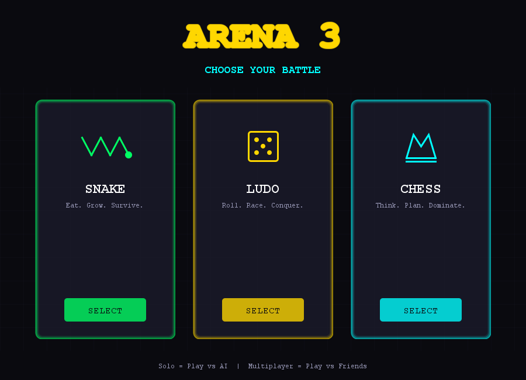
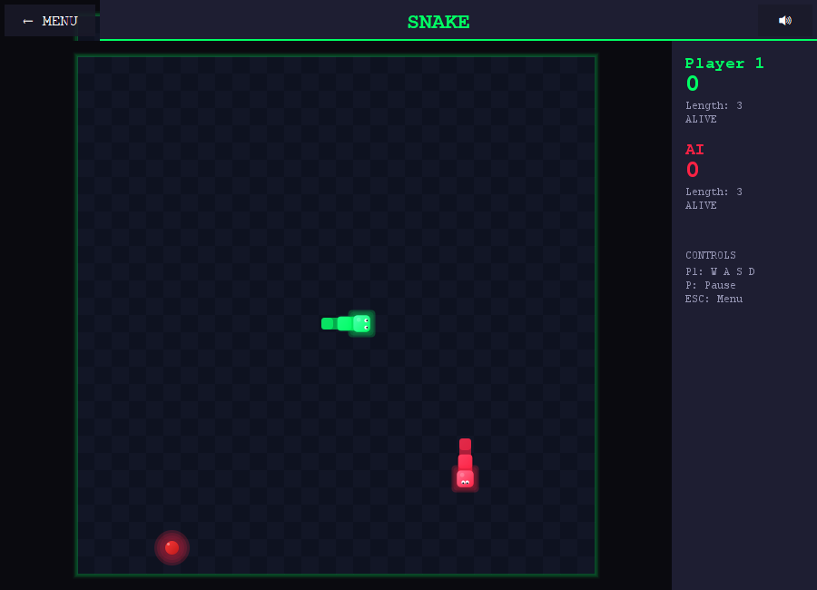
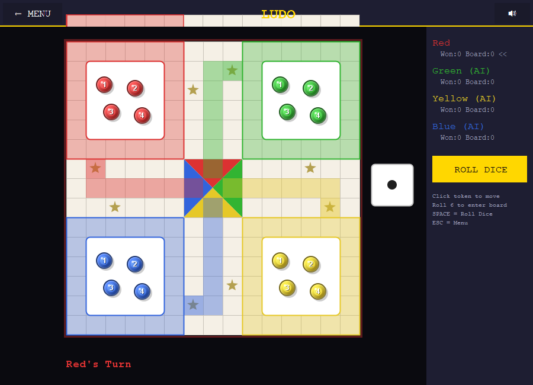
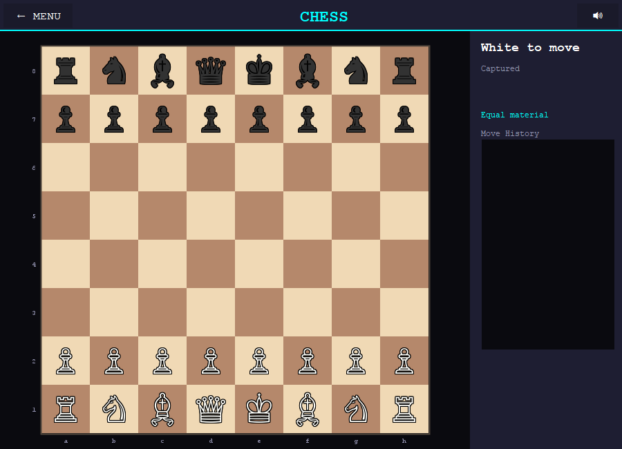

# ARENA 3 🎮

A premium, zero-dependency Java desktop game suite featuring three classic games:
**Snake**, **Ludo**, and **Chess** — all with intelligent AI opponents, rich MIDI sound effects, and a dark luxury aesthetic.



---

## 🚀 Features

- **🎮 Snake**: Solo mode with an AI snake using BFS pathfinding, or local 2-player multiplayer.
- **🎲 Ludo**: Supports 2 to 4 players (human or AI) with smart move heuristics.
- **♟️ Chess**: High-fidelity Chess engine with full rules (castling, promotion, checkmate), custom clock, and a Minimax AI with Alpha-Beta pruning.
- **🎨 Aesthetics**: Hand-tailored dark luxury palette with neon accents and interactive animations.
- **🎵 Retro Audio**: Integrated MIDI Synthesizer sound engine for retro sound effects.
- **🛠️ Zero Dependencies**: Compiles and runs on pure Java SE.

---

## 🐍 Snake Game

Play against a path-finding AI or challenge a friend in local multiplayer.



### Controls & Rules
| Control | Player 1 | Player 2 |
| :--- | :--- | :--- |
| **Move Up** | `W` | `↑` |
| **Move Down** | `S` | `↓` |
| **Move Left** | `A` | `←` |
| **Move Right** | `D` | `→` |
| **Pause** | `P` or `Space` | - |

- **Solo Mode**: Face off against an AI snake that calculates pathing in real-time.
- **Difficulty settings**:
  - *Easy*: AI recalculates path every 5 game ticks.
  - *Medium*: AI recalculates path every 3 ticks with slight randomness.
  - *Hard*: AI recalculates path every single game tick.
- **Speed scaling**: Snake speed automatically increases every 50 points.

---

## 🎲 Ludo Game

A full implementation of the traditional board game with custom rule configurations.



- **Roll Dice**: Click the **ROLL DICE** button or press `Space`.
- **Move Tokens**: Interactive highlighting indicates which tokens are eligible to move.
- **Players**: 2, 3, or 4 players (configured as human or AI in setup).
- **Features**: Traditional rules (roll 6 to enter, capture opponents, safe star squares, exact roll to win).
- **AI Behavior**:
  - *Easy*: Selects random legal moves.
  - *Hard*: Uses heuristic weighting (prioritizes captures > entering the board > advancing furthest tokens > safe spots).

---

## ♟️ Chess Game

A feature-rich chess experience with multiple difficulty levels and game modes.



- **Interactive UI**: Highlights selected piece, valid moves, and last move made.
- **Rules**: Full chess rules including Castling, En Passant, Pawn Promotion, and check/checkmate/stalemate detection.
- **Analytics Sidebar**: Complete move log in standard algebraic notation, captured pieces tray, and real-time material advantage indicator.
- **Timer**: Optional 5 or 10-minute game clocks.
- **AI System**:
  - *Easy*: Evaluates random legal moves.
  - *Medium*: Minimax search at Depth 2 with Alpha-Beta pruning.
  - *Hard*: Minimax search at Depth 3 using positional evaluation tables (piece-square tables).

---

## 🛠️ Requirements & Setup

### Requirements
- **Java SE Development Kit (JDK) 11** or higher.
- No external dependencies (uses native `javax.swing`, `java.awt`, and `javax.sound.midi`).

### Quick Start (Windows)
Double-click `build.bat` or run:
```cmd
build.bat
```

### Manual Compilation and Run
To build and run manually from the command line:

```bash
# 1. Compile sources to output directory
mkdir out
dir /s /b src\*.java > sources.txt
javac -d out @sources.txt
del sources.txt

# 2. Package into an executable JAR
echo Main-Class: arena3.Main > manifest.txt
jar cfm Arena3.jar manifest.txt -C out .
del manifest.txt

# 3. Run the application
java -jar Arena3.jar
```

---

## 📁 Project Structure

```
arena3/
├── src/arena3/
│   ├── Main.java              # App entry point
│   ├── core/                  # Engine & Infrastructure (Sound, State)
│   ├── menu/                  # Screens for main menu & player config
│   ├── ui/                    # Styling definitions (ThemeConstants)
│   ├── snake/                 # Snake game panels & AI pathfinding
│   ├── ludo/                  # Ludo board, tokens, rules & heuristics
│   └── chess/                 # Chess engine, board rendering, minimax AI
├── docs/                      # Screenshots and visual media
├── build.bat                  # Automated Windows build script
├── claude.md                  # Developer architectural guide
└── README.md                  # Main project presentation
```

---
*Built with passion using pure Java Swing.*
